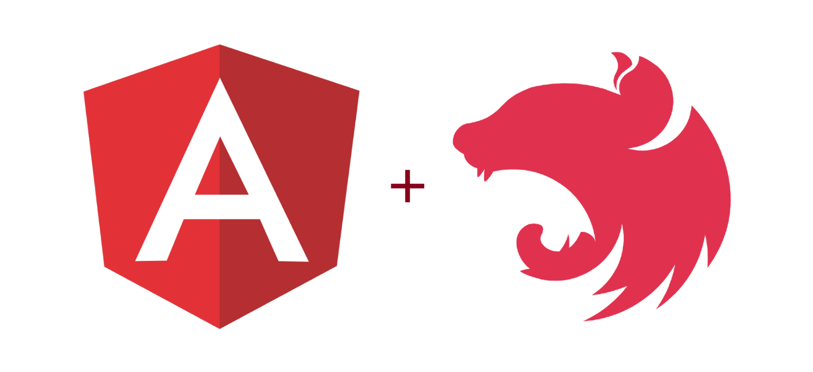

# Nest JS & Angular: CMS

_May 2022_

> 🔨 Nest JS & Angular - CMS. From udemy: [Créer une app FullStack TypeScript avec Angular et NestJS](https://www.udemy.com/course/creer-une-app-fullstack-typescript-avec-angular-et-nestjs).

---

<h1 align="center">
    
</h1>

## Installation

```bash
$ npm install
```

## Running the app (Nest JS: Server)

```bash
# development
$ cd server
$ npm run start

# watch mode
$ cd server
$ npm run start:dev

# production mode
$ cd server
$ npm run start:prod
```

Launch: [http://localhost:3000/](http://localhost:3000/)

## Running the app (Angular: Client)

```bash
# development
$ cd client
$ npm run start

# production mode
$ cd client
$ npm run build
```

Launch: [http://localhost:4200/](http://localhost:4200/)

## Dependancies: Nest JS

- [@nestjs/mongoose](https://www.npmjs.com/package/@nestjs/mongoose): Mongoose module for Nest.

`npm install --save @nestjs/mongoose mongoose`

NB:

1. with Mongoose, to connect Mongo Atlas database, we need to use the older connection string: `mongodb://<username>:<password>@<main-shard-00-00-03xkr.mongodb.net>:27017,<cluster0-shard-xx-xx-xxxxx.mongodb.net>:27017,<cluster0-shard-xx-xx-xxxxx.mongodb.net>:27017//<dbname>?ssl=true&replicaSet=Main-shard-0&authSource=admin&retryWrites=true`
2. with ConfigModule, we can use the newer string: `mongodb+srv://<username>:<password>@<cluster0-shard-xx-xx-xxxxx.mongodb.net>/<dbname>?retryWrites=true&w=majority`

- [@nestjs/config](https://www.npmjs.com/package/@nestjs/config): Configuration module for Nest based on the dotenv (to load process environment variables) package.

`npm i --save @nestjs/config`

## Useful links

- [codeconcept/cms-nestjs](https://github.com/codeconcept/cms-nestjs)
- [codeconcept/cms-nestjs-ng](https://github.com/codeconcept/cms-nestjs-ng)
- [Nest: Environment configuration](https://docs.nestjs.com/techniques/configuration)
- [Angular: Jasmine core problem](https://stackoverflow.com/questions/67433893/unable-to-resolve-dependency-tree-error-for-creating-new-angular-project)
- [Angular Building blocks](https://slides.com/sajeetharan/deck-62536557-5a27-40cd-a98e-3fc7f3c6517a-11-10#/14)

## License

Nest is [MIT licensed](LICENSE).
